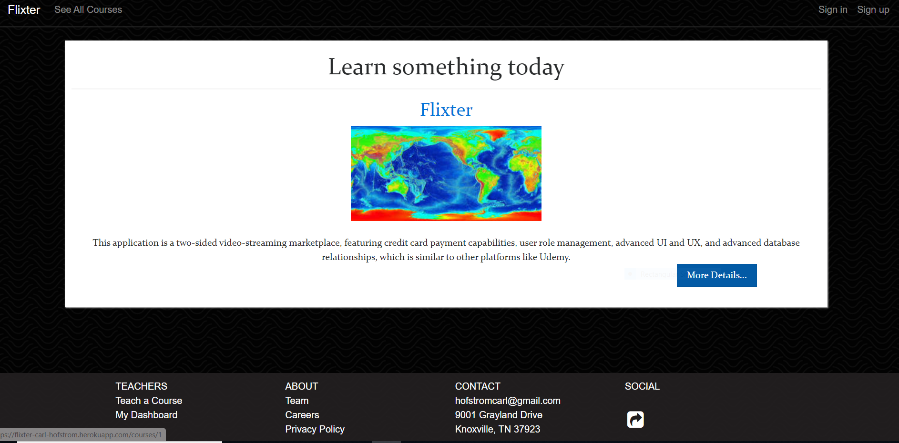

Teach your own course with this application! 

Once you create your course, you can drag and drop your lessons accordingly and keep track of the courses you are teaching and learning in your own private dashboard. At this time it does not include the ability to edit lessons and sections, but here are the features included in this application which I now have a good grasp on:

two-sided video-streaming marketplace,
credit card payment capabilities,
user role management,
UI and UX, 
advanced database relationships

Created with Ruby on Rails
Carl Hofstrom hofstromcarl@gmail.com
