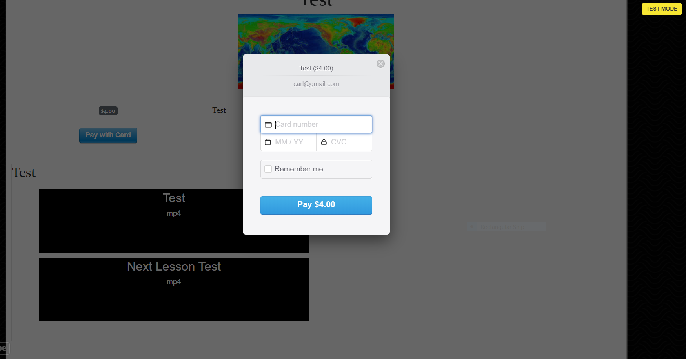

Teach your own course with this application! 

How to use:
1) https://flixter-carl-hofstrom.herokuapp.com
2) Click 'Learn More' then 'More Details..'    (gives a basic overview)
3) Sign up  (automatically signs you in)

4) Click 'Pay with Card' to enroll (Use CC# 4242-4242-4242-4242 and make up a current expiration and any three digit CVC)

5) View Videos by clicking on them
6) Click Next Lesson..
7) Click My Dashboard

8) Click 'Teach a Course' at the bottom left and enter data in the appropriate fields. For cost, enter a number like 1, 10, 100, ect. and if you enter 0, your course will be free with no enrollment necessary)

9) Click 'Add a section'
10) Click 'Add a lesson' (use mp4 videos)

11) Click 'Administrator' (here you can 'view as a student' and if you repeat step 10 again, you can drag and drop lessons accordingly)

12) Click 'Flixter' in upper left corner to go back to homepage
13) Click 'See all courses' to see your new course
14) Click 'Sign Out' in upper right

Application Features:

two-sided video-streaming marketplace,
credit card payment capabilities,
user role management,
UI and UX, 
advanced database relationships,
validations and permissions 

Technologies Used:
Ruby on Rails, Figaro, Stripe, Bootstrap, Simpleform, subtlepatterns.com, Carrierwave, Javascript for drag & drop

Created with Ruby on Rails by
Carl Hofstrom hofstromcarl@gmail.com
https://flixter-carl-hofstrom.herokuapp.com
